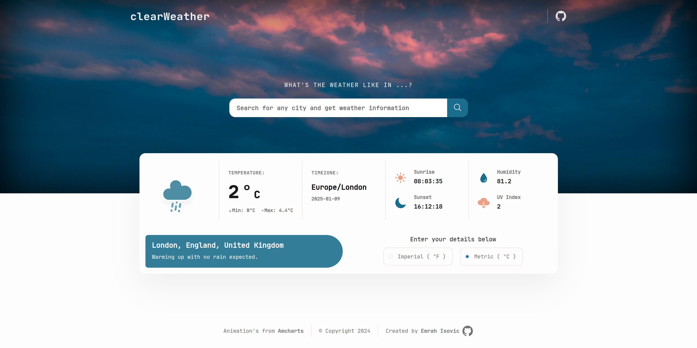
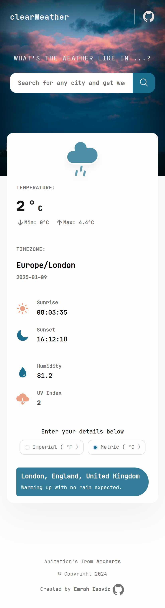

# Weather-app

clearWeather is a weather app that provides instant weather updates and daily forecasts. The app delivers real-time weather conditions and accurate daily predictions to help users plan their day with ease.

## Table of concepts

- [Overview](#overview)
  - [Screenshot](#screenshot)
  - [Links](#links)
- [Built with](#built-with)
- [Author](#author)

## Overview

### Screenshots

### Links

- Live preview - [Weather app](https://emrahiso.github.io/Weather-app/)
- GitHub repo - [Weather app Repo](https://github.com/EmrahIso/Weather-app.git)

## Built with

- HTML
- CSS
- SCSS
- JS
- WEBPACK

## Author

- GitHub - [@EmrahIso](https://github.com/EmrahIso)
